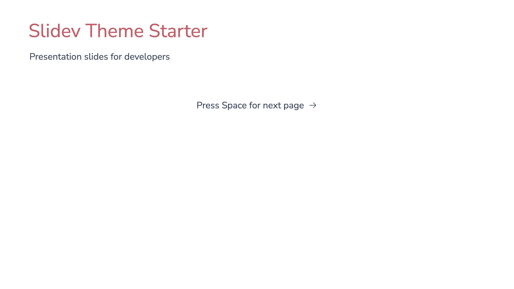
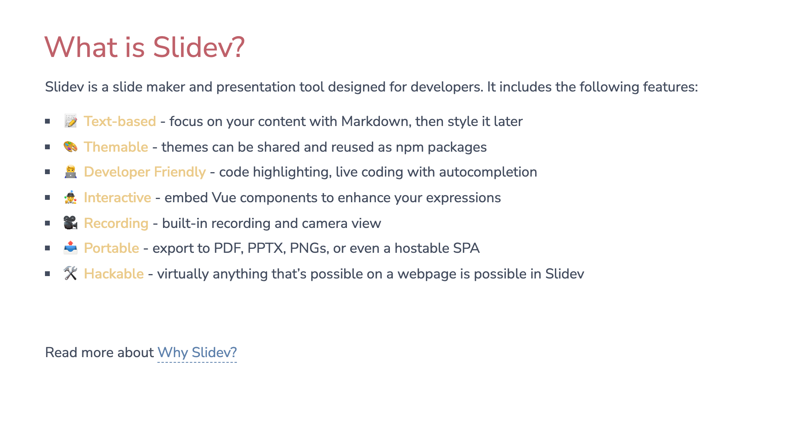
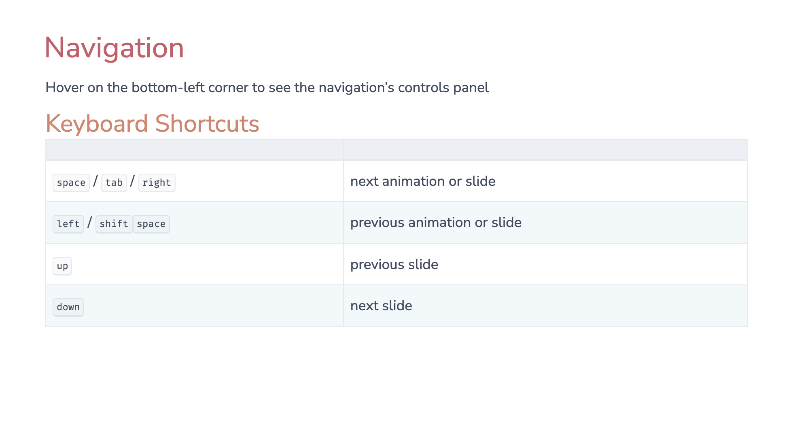
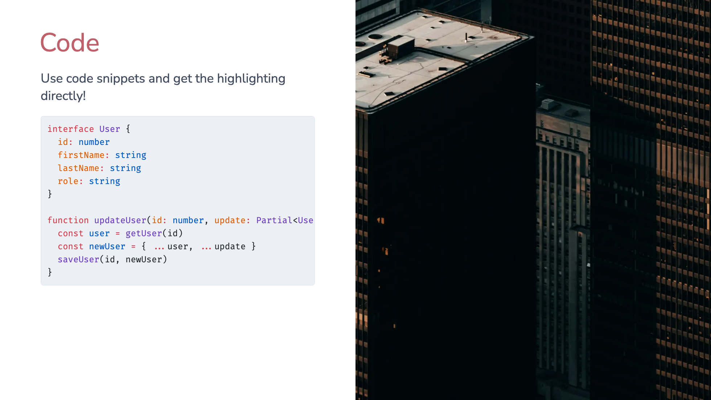
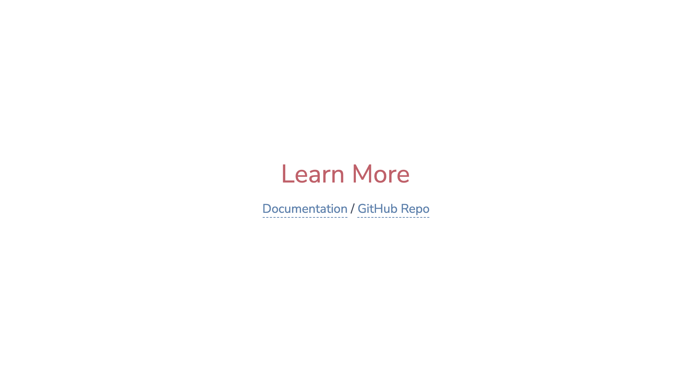
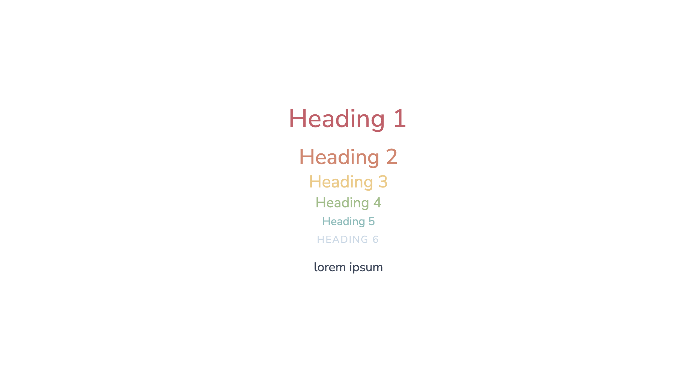
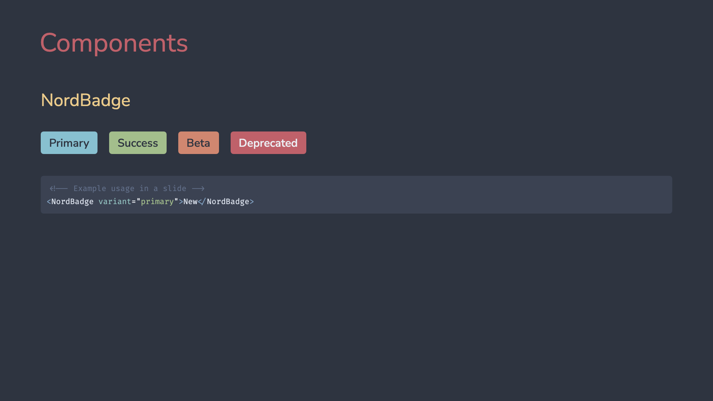

# slidev-theme-nord

[](https://www.npmjs.com/package/slidev-theme-nord)

A [Nord](https://www.nordtheme.com/) inspired theme for [Slidev](https://github.com/slidevjs/slidev).

## Install

Add the following frontmatter to your `slides.md`. Start Slidev then it will prompt you to install the theme automatically.

```
theme: <b>nord</b>
```

Learn more about [how to use a theme](https://sli.dev/guide/theme-addon#use-theme).


## Screenshots










## Layouts

This theme uses the base layouts.

## Components

This theme provides the following components:
- NordBadge : A button-esque badge component using the Nord pallet.


## Contributing

- `pnpm install`
- `pnpm run dev` to start theme preview of `example.md`
- Edit the `example.md` and style to see the changes
- `pnpm run export` to generate the preview PDF
- `pnpm run screenshot` to generate the preview PNG
